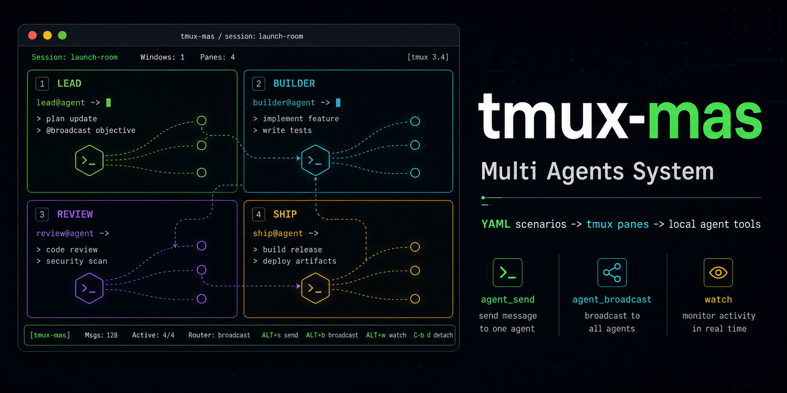
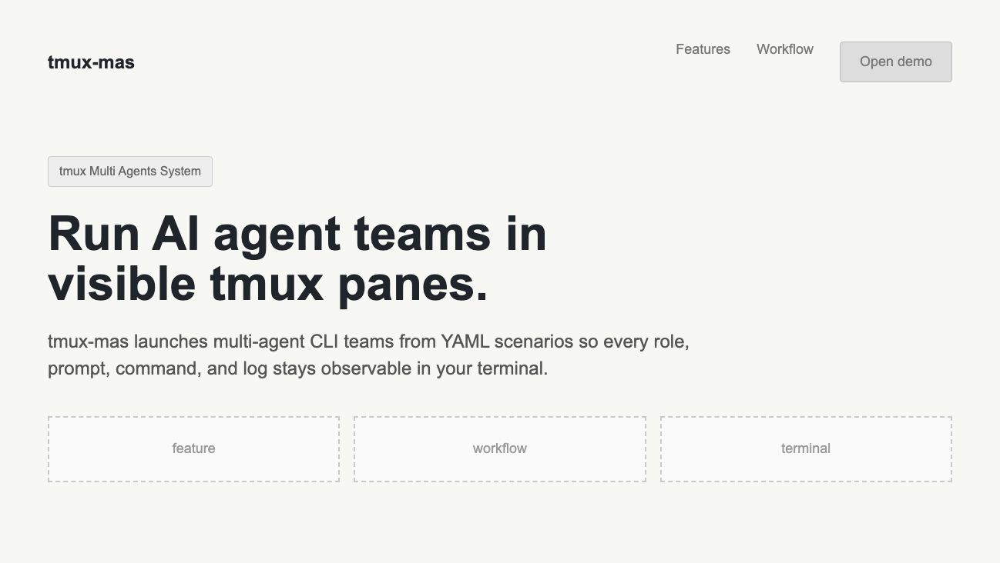
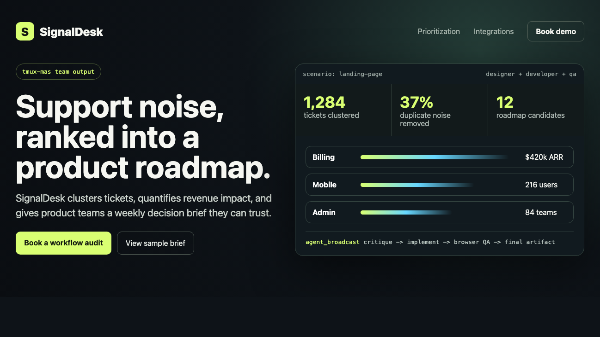
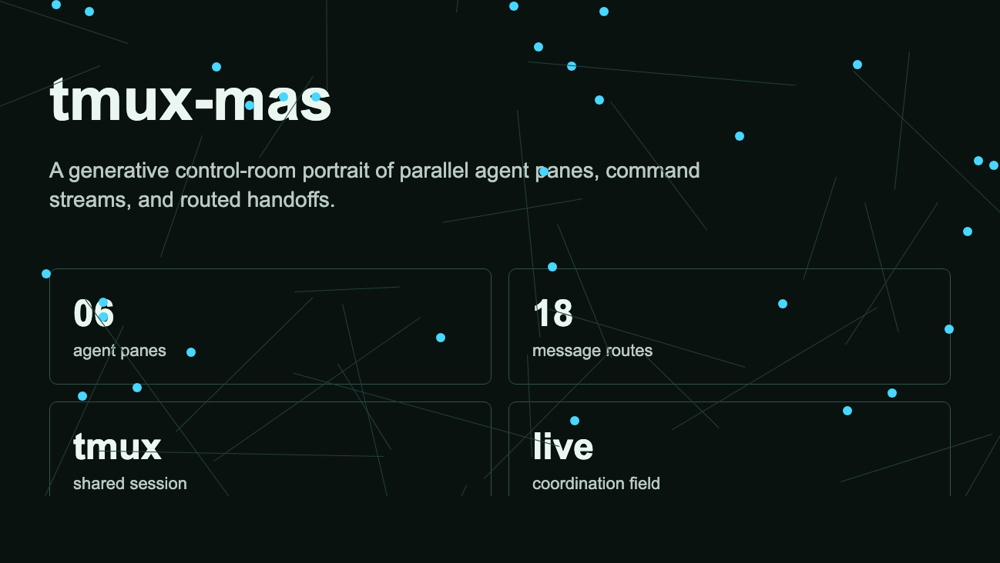
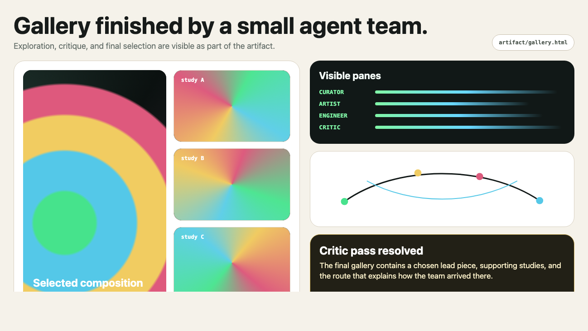
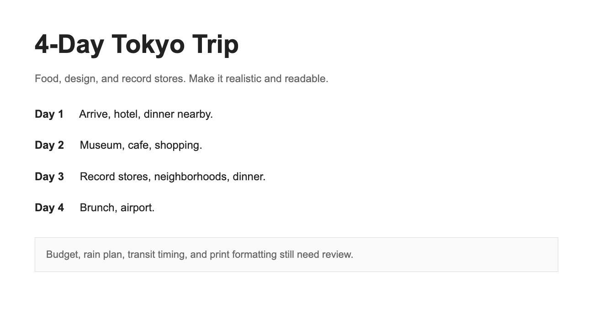
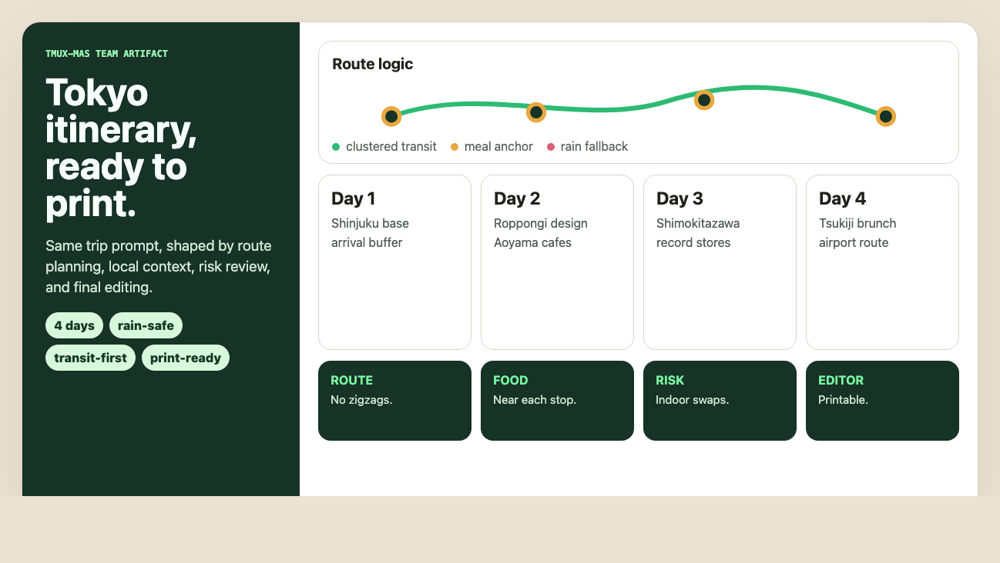

<p align="center">
  
</p>

<h1 align="center">tmux-mas</h1>

<p align="center">
  <strong>tmux Multi Agents System</strong>
  <br>
  Run agent CLI teams in tmux panes.
</p>

<p align="center">
  <a href="https://github.com/choism4/tmux-mas/actions/workflows/ci.yml"></a>
  <a href="LICENSE"></a>
  
  
  
</p>

<p align="center">
  Requires <code>tmux</code>. <code>cmux</code> is not required.
</p>

`tmux-mas` means **tmux Multi Agents System**. It turns a YAML scenario into a
live tmux room where each agent CLI gets its own pane, prompt, role, and
run-local communication tools.

| You define | `tmux-mas` starts | You inspect |
| --- | --- |
| A scenario file with agents, runner command, tools, and success criteria. | A real tmux session with named panes and injected `agent_send` / `agent_broadcast`. | The panes directly with `attach`, `status`, and `watch`; no hidden coordinator. |

---

The launcher starts the team and then steps out. Agents talk through run-local
tools instead of global shell hacks, so the coordination surface stays visible
and reproducible.

## Why

`tmux-mas` keeps the coordination surface explicit and reproducible:

| What you get | Why it matters |
| --- | --- |
| One agent CLI per tmux pane | Every participant is visible, inspectable, and interruptible. |
| YAML scenarios | Teams are reproducible, reviewable, and shareable. |
| Run-local tools | Agents communicate through a stable contract, not shell glue. |
| Runner command prefixes | Use `codex`, `claude`, `gemini`, or any custom agent CLI. |
| Required system package | `tmux` is required. `cmux` is not. |

## Same Prompt, Different Runtime

Read each pair left to right. The left image is the single-agent baseline; the
right image is the `tmux-mas` team run. The point is to compare the artifact,
not the story around it.

### 1. Landing Page

| Baseline | tmux-mas run |
| --- | --- |
|  |  |

What to compare: the team output is more product-specific, with a clearer
terminal-native visual signal and less generic SaaS framing.

```bash
tmux-mas run landing-page
```

Scenario: [`landing-page.yml`](scenarios/landing-page.yml)

### 2. Generative Art Studio

| Baseline | tmux-mas run |
| --- | --- |
|  |  |

What to compare: the team output organizes the prompt into explicit panes,
roles, and message paths instead of a looser abstract network.

> Create a browser-openable generative art gallery. Explore a visual direction,
> implement it, critique it, and produce the final artifact.

```bash
tmux-mas run generative-art-studio-codex
```

```text
runs/<id>/artifact/gallery.html
```

Scenario: [`generative-art-studio-codex.yml`](scenarios/generative-art-studio-codex.yml)

### 3. Travel Itinerary as a Print-Ready PDF Source

| Baseline | tmux-mas run |
| --- | --- |
|  |  |

What to compare: the team output foregrounds trip logic and constraints before
the daily plan, making the itinerary easier to audit.

> Plan a four-day Tokyo trip for food, design, and record stores. Make it
> realistic, readable, rainy-day safe, and print-ready.

```bash
tmux-mas run travel-itinerary-pdf-claude
```

```text
runs/<id>/artifact/itinerary.html
runs/<id>/artifact/itinerary.md
```

Scenario: [`travel-itinerary-pdf-claude.yml`](scenarios/travel-itinerary-pdf-claude.yml)

## Install

```bash
git clone https://github.com/choism4/tmux-mas.git
cd tmux-mas
./install.sh
```

Default install target:

```text
~/.local/bin/tmux-mas
```

Custom prefix:

```bash
PREFIX=/usr/local ./install.sh
```

You can also run it directly from the repo:

```bash
./tmux-mas --help
```

## Quick Start

From the repo root, refresh the local binary if needed:

```bash
./install.sh
```

Then validate and run a small scenario:

```bash
./tmux-mas doctor hello-claude
./tmux-mas run hello-claude
./tmux-mas attach hello-claude
```

If Claude asks to trust the workspace, select `1. Yes`.

Stop it:

```bash
./tmux-mas stop hello-claude
```

Run a public team scenario with a visible session name:

```bash
./tmux-mas doctor landing-page
./tmux-mas run landing-page
./tmux-mas attach landing-page-team-yml
```

Run the deterministic mock test suite:

```bash
python3 tests/run_mock_scenarios.py
python3 tests/run_public_scenarios_with_mock.py
python3 tests/run_public_scenarios_with_mock.py --jobs 8
```

## The Core Idea

Each agent receives a prompt that includes:

- its role
- the participant pane map
- shared resources
- available tools
- scenario rules
- success criteria

Agents then communicate with injected run-local commands:

```bash
agent_send %214 "HOST: Did this tmux message reach you?"
agent_broadcast "LEAD: Everyone give one concrete risk."
```

tmux-mas renders the prompt, appends it to the runner command, and sends the
scenario-specific submit key after the message text.

## Scenario Example

```yaml
name: hello-claude
session: hello-claude
window: team

runner:
  type: claude
  command: claude --dangerously-skip-permissions
  submit_key: Enter

agents:
  - id: HOST
    role: Starts the exchange, asks one concise question, and closes after one reply.
  - id: GUEST
    role: Replies once with a concise answer, then stops.

tools:
  - send
  - broadcast

kickoff:
  agent: HOST
  prompt: Send GUEST one short greeting and ask whether the tmux message reached them.

rules:
  - Keep messages short.
  - Receiving a message does not require a response unless your role has useful input.
  - Stop after the first complete exchange.

success:
  - HOST sends one message to GUEST.
  - GUEST sends one reply to HOST.
  - Both agents stop naturally.
```

## Runners

Presets:

```yaml
runner: codex
runner: claude
runner: gemini
```

Public scenarios should prefer explicit runner objects:

```yaml
runner:
  type: custom
  command: my-agent --some-flag
  submit_key: C-m
```

`runner.command` is an agent-calling prefix. `tmux-mas` appends the rendered
prompt as the final shell argument:

```bash
exec <runner.command> "$(cat <prompt-file>)"
```

Known local submit keys:

| Agent TUI | `submit_key` |
| --- | --- |
| Codex | `C-m` |
| Claude Code v2.1.133 | `Enter` |

## Commands

| Command | Purpose |
| --- | --- |
| `tmux-mas --help` | Show the full CLI. |
| `tmux-mas --version` | Print the installed version. |
| `tmux-mas list` | Print bundled scenarios. |
| `tmux-mas doctor [scenario]` | Check `tmux`, `python3`, `PyYAML`, and optionally validate a scenario and runner. |
| `tmux-mas run <scenario.yml or scenario-name>` | Start a tmux session from a YAML file or bundled scenario name. |
| `tmux-mas status [session]` | Print tmux sessions, or panes for one session. |
| `tmux-mas watch <session>` | Poll pane output and report `changed`, `quiet`, `idle`, `dead`, and `exited` panes. |
| `tmux-mas attach <session>` | Attach to the tmux session. |
| `tmux-mas stop <session>` | Kill the tmux session. |

`watch` is the operator awareness loop. Use `--once` for a single snapshot and
`--idle-seconds` to control when a pane is considered idle:

```bash
tmux-mas watch hello-claude --idle-seconds 120
tmux-mas watch hello-claude --once
```

## Requirements

Required:

- `tmux`
- `python3`
- `PyYAML`
- the command named by `runner.command`

Optional:

- `agent-browser` for browser/UI scenarios

Not required:

- `cmux`

## Docs

- [Agent Operator Guide](docs/agent-operator-guide.md)
- Scenario examples: `scenarios/hello-claude.yml`, `scenarios/hello-codex.yml`, `scenarios/hello-gemini.yml`, `scenarios/landing-page.yml`, `scenarios/generative-art-studio-codex.yml`, `scenarios/travel-itinerary-pdf-claude.yml`
- More scenarios: `scenarios/`
- Mock scenarios for CI: `tests/fixtures/scenarios/`

## Status

Experimental, but intentionally small. Treat agent output as untrusted, keep
scenario files explicit, and inspect the tmux panes when behavior matters.
